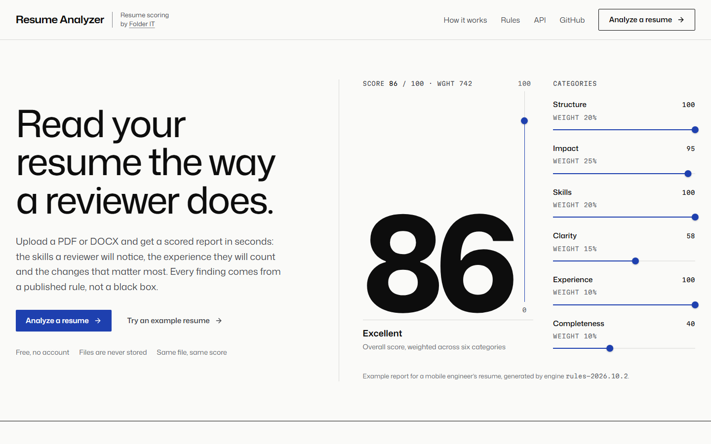
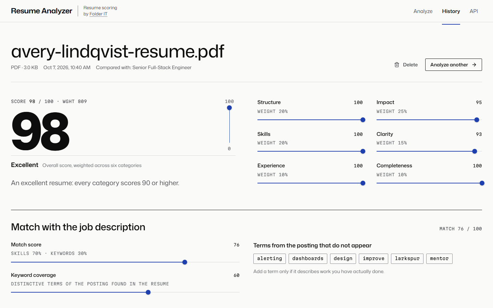
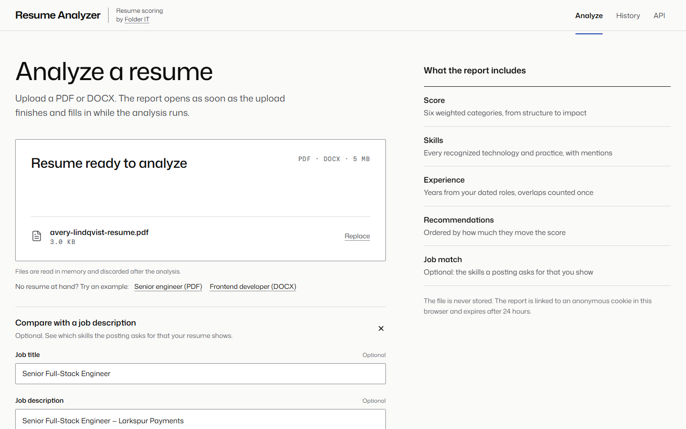
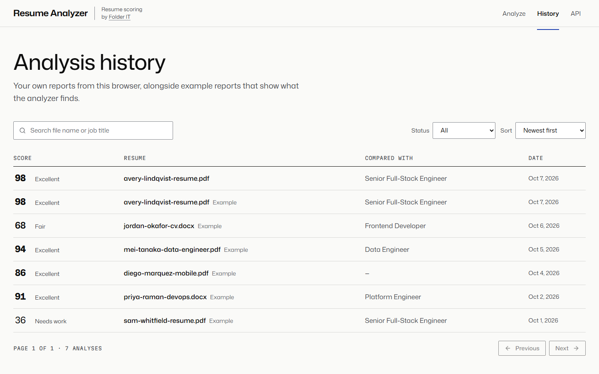

<div align="center">
  <p>
    <a align="center" href="https://www.folderit.net" target="_blank">
      
    </a>
  </p>

<br>

[web resume analyzer](https://github.com/FolderITDev/web-resume-analyzer)

<br>

[](LICENSE.md)


[](.github/workflows/quality.yml)

</div>

<details>
<summary><strong>Table of Contents</strong></summary>

- [Hello](#hello)
- [Overview](#overview)
  - [What this is](#what-this-is)
  - [What this is not](#what-this-is-not)
  - [Features](#features)
- [Screenshots](#screenshots)
- [Install](#install)
- [Quickstart](#quickstart)
- [Architecture](#architecture)
  - [Repository layout](#repository-layout)
  - [API](#api)
  - [Database](#database)
  - [Engineering decisions](#engineering-decisions)
- [Tests and verification](#tests-and-verification)
- [SEO and structured data](#seo-and-structured-data)
- [Privacy and limitations](#privacy-and-limitations)
- [Documentation](#documentation)
- [FAQ](#faq)
- [About Folder IT](#about-folder-it)
- [License](#license)

</details>

## Hello

**[Folder IT](https://folderit.net) is a nearshore software development company that builds and scales AI-ready engineering teams for U.S. companies.** With 220+ software engineers, Folder IT delivers senior technical talent for organizations building AI software.

**Core capabilities:** Nearshore Staff Augmentation · AI-Ready Engineering Teams · AI Software Development · IoT Development · Web & Mobile Apps · Salesforce Consulting · ServiceNow Development

This repository holds one of its products: **Resume Analyzer**, a full-stack web application that scores PDF and DOCX resumes through an analysis engine, built with Next.js 16, React 19, strict TypeScript, PostgreSQL and Drizzle ORM. A visitor uploads a resume, optionally pastes a job description, follows the analysis as it runs and reads a report with a score, detected skills, years of experience, strengths, issues and prioritized recommendations.

## Overview

### What this is

- A **full-stack web application**: a public, indexable landing page, the analyzer itself, a REST API documented with OpenAPI 3.1, and PostgreSQL persistence with versioned migrations.
- **Asynchronous document processing on the web**: the upload returns `202 Accepted`, the file is handed to the analysis engine as a job, and the browser follows each stage the engine reports until the report is ready.
- **Explainable scoring**: every strength, issue and recommendation carries the stable ID of the check that produced it.
- **A typed integration with an external service**: the analysis engine is reached over HTTP at `ANALYSIS_ENGINE_URL`, and every response is validated against its Zod contract before it reaches the database.
- Original source code under the MIT license, with self-hosted fonts.

### What this is not

- Not an applicant tracking system. There are no accounts, candidates, jobs or recruiter workflows.
- Not a hiring decision tool. The score measures how clearly a resume communicates, not a person's ability.
- Not a document store. Uploaded files are forwarded to the analysis engine and never written to this application's disk or database.

### Features

- **Upload with real progress.** Drag and drop or browse for a PDF or DOCX up to 5 MB. The browser checks the file at once; the server verifies its bytes, not its name. Uploads can be cancelled.
- **Asynchronous pipeline.** Received → Extracting → Parsing → Matching → Scoring, as reported by the analysis engine, stored on the analysis and shown live with TanStack Query polling.
- **Report.** A score from 0 to 100 across six weighted categories, a one-sentence summary, recommendations ordered by priority, strengths and issues with their check IDs, every detected skill with its mentions, estimated years of experience from merged date ranges, and document statistics.
- **Job description match.** Skills the posting asks for that the resume shows and lacks, keyword coverage and the distinctive terms that never appear.
- **History.** Example reports plus the visitor's own, with search, status filter, sorting and pagination kept in the URL, and optimistic deletion.
- **Examples.** A PDF and a DOCX resume can be loaded with one click, together with a matching job description.
- **Public API.** The same endpoints the interface uses, with RFC 9457 errors and an OpenAPI 3.1 document generated from the Zod contracts.

## Screenshots

<p align="center">
  
  
</p>
<p align="center">
  
  
</p>

<sub>Captured from a production build of this repository in Chromium at 1440 × 900.</sub>

## Install

Requirements:

- **Node.js 24 or later** (pinned in `.node-version`) and **pnpm 10** (pinned in `packageManager`; `corepack enable` installs it).
- **Docker** to run PostgreSQL 17 locally, or any PostgreSQL 15+ server.
- The base URL of the **analysis engine** (and its API key, if it requires one), set as `ANALYSIS_ENGINE_URL` and `ANALYSIS_ENGINE_API_KEY` in `.env`. Without it, the landing page, the API reference and the history work, and new uploads fail with `engine_unavailable`.

```bash
git clone https://github.com/FolderITDev/web-resume-analyzer.git
cd web-resume-analyzer
pnpm install
cp .env.example .env
```

This folder is standalone: it has its own dependencies, lockfile and database, and imports nothing from other Folder IT repositories.

## Quickstart

```bash
docker compose up -d
```

```bash
pnpm db:migrate
```

```bash
pnpm db:seed
```

```bash
pnpm dev
```

Open [http://localhost:3010/apps/resume-analyzer](http://localhost:3010/apps/resume-analyzer). The app is served under the `/apps/resume-analyzer` base path.

**Quick tour**

1. Choose **Try an example resume**. An example PDF and a matching job description are loaded.
2. Choose **Analyze resume** and watch the stages complete.
3. Read **What to change first**, then the strengths, issues and the skills grid, where skills the job asks for are set in blue and missing ones are outlined.
4. Open **History**, search for "engineer" and sort by score.
5. Upload your own resume. It stays private to your browser and expires after 24 hours.

## Architecture

```text
Browser ──── upload (XHR progress) · polling (TanStack Query) ────┐
   │                                                               │
   ▼                                                               ▼
Next.js App Router ── Server Components for public pages · client islands for the tool
   │
   ▼
REST API (Route Handlers) ── Zod validation in and out · RFC 9457 problems · after()
   │
   ▼
Services ── use cases; analysis jobs ──► Analysis engine (HTTP, ANALYSIS_ENGINE_URL)
   │
   ▼
Repositories ── Drizzle queries only
   │
   ▼
PostgreSQL ── analyses and reports, never the file
```

The upload handler validates the request, records a queued analysis and responds `202` with a `Location` header. Next.js `after()` then submits the file to the analysis engine's job API (`POST /v1/resume-analyses`), stores the engine's job ID and reads the job (`GET /v1/resume-analyses/{id}`) until it settles, persisting every stage the engine reports. A completed job's report is validated against the `AnalysisReport` contract and stored; a failed job keeps the engine's error code and message. The browser polls the analysis every 700 ms and stops at a terminal status.

### Repository layout

| Path                   | What it holds                                                                                                       |
| ---------------------- | ------------------------------------------------------------------------------------------------------------------- |
| `src/app/(marketing)/` | Public, indexable pages: the landing page and the API reference.                                                    |
| `src/app/(tool)/`      | The tool: upload, report and history. Marked `noindex`.                                                             |
| `src/app/api/`         | Route Handlers: thin adapters from HTTP to services.                                                                |
| `src/server/`          | Server-only code: services, repositories, the Drizzle schema, the analysis engine client, HTTP helpers and OpenAPI. |
| `src/lib/validation/`  | Zod contracts shared by the API, the browser client and the OpenAPI document.                                       |
| `src/lib/api/`         | The typed browser client, with upload progress and typed errors.                                                    |
| `src/features/`        | Feature UI: the upload form, report, history and landing sections, plus TanStack Query options.                     |
| `src/components/`      | The design system: specimen components, buttons, fields and feedback.                                               |
| `src/content/`         | Example resumes, job postings, the engine's reports for them and FAQ copy.                                          |
| `drizzle/`             | Generated SQL migrations.                                                                                           |
| `tests/`               | Unit, component and integration tests (Vitest) and the engine contract double they run against.                     |
| `e2e/`                 | End-to-end and accessibility tests (Playwright and axe).                                                            |
| `docs/`                | Architecture, API errors, AI-assisted engineering, font licenses and screenshots.                                   |

### API

| Method   | Path                         | Purpose                                                                     |
| -------- | ---------------------------- | --------------------------------------------------------------------------- |
| `POST`   | `/api/resumes/analyze`       | Upload a resume (multipart). Responds `202` with the analysis to poll.      |
| `GET`    | `/api/resumes/analyses`      | List examples and your analyses. `page`, `pageSize`, `status`, `q`, `sort`. |
| `GET`    | `/api/resumes/analyses/{id}` | One analysis, with its report once completed.                               |
| `DELETE` | `/api/resumes/analyses/{id}` | Delete one of your analyses.                                                |
| `GET`    | `/api/openapi.json`          | OpenAPI 3.1 document.                                                       |
| `GET`    | `/api/health`                | Liveness and database readiness.                                            |

All paths are relative to `/apps/resume-analyzer`. Errors use `application/problem+json` with a stable `code`; see [docs/api.md](docs/api.md).

```bash
curl -i -X POST http://localhost:3010/apps/resume-analyzer/api/resumes/analyze -F "file=@tests/fixtures/avery-lindqvist.pdf"
```

### Database

One table, `analyses`, defined in [`src/server/db/schema.ts`](src/server/db/schema.ts): file metadata, status and stage enums, the score and grade, the report as JSONB, the engine's job ID and version, error details and timestamps. Check constraints keep scores in range and require every row to be either an example or owned by a session. Indexes cover the two list queries (examples and one owner, newest first).

```bash
pnpm db:generate   # create a migration after changing the schema
pnpm db:migrate    # apply migrations
pnpm db:seed       # replace the example analyses with the stored engine reports; visitor analyses are untouched
```

### Engineering decisions

- **Contracts first.** Every request and response is a Zod schema in `src/lib/validation`. Handlers parse input, validate output before sending it, and the OpenAPI document is generated from the same schemas, so documentation and behavior cannot drift.
- **The engine is a dependency, not a module.** The analysis runs in an external engine behind `ANALYSIS_ENGINE_URL`. The client in `src/server/analysis-engine` is the only code that knows its URL; its responses are parsed with Zod like any untrusted input, and transport failures, timeouts and contract violations all end in a failed analysis with `engine_unavailable`.
- **Work after the response.** The upload is answered as soon as it is validated and recorded; the engine job is submitted and followed in `after()`. Every stage the engine reports is persisted, so the interface shows the job's real progress and nothing else.
- **Files never persist here.** Bytes are held in memory only until they are handed to the engine. Only metadata and the report are stored.
- **Anonymous ownership.** A random token in an HttpOnly cookie identifies the browser; only its SHA-256 hash is stored. Visitors see examples and their own analyses, nothing else.
- **Server and client rendering by purpose.** Public pages are prerendered Server Components showing stored engine reports. Only interactive pieces are client components.
- **Motion as the specimen moves.** The score's font weight settles to its value and axis knobs sweep into place with `@starting-style` and transforms only. Reduced motion is respected.

Full rationale: [docs/architecture.md](docs/architecture.md).

## Tests and verification

```bash
pnpm check          # ESLint, typegen + strict TypeScript, and every Vitest project
pnpm format:check   # Prettier, including Tailwind class order
pnpm build          # production build
pnpm test:e2e       # Playwright against the production build (desktop and mobile)
```

Integration tests need the test database created by `docker/init-test-db.sql` (run automatically the first time `docker compose up` creates the volume). Integration and end-to-end tests run against a double of the engine's job API in `tests/support/analysis-engine.ts`, so they never reach a real engine.

The suites cover:

- **Unit:** the engine client (request shape, API key, contract validation, HTTP and network failures) and the pipeline (every reported stage recorded, engine errors kept, an unavailable engine failing the analysis).
- **Components:** accessible meters, the score-to-weight mapping, alerts and status messages, finding lists and empty states.
- **Integration:** every endpoint through its real Route Handler and a real PostgreSQL database: PDF and DOCX uploads, job matching, image-only files, spoofed and oversized files, validation errors, privacy between visitors, search, sorting, pagination, LIKE escaping, deletion rules and the OpenAPI document.
- **End-to-end:** uploading a PDF and reading the report, comparing an example with its job description, rejecting an unsupported file, structured data and indexing rules, and axe WCAG 2.2 AA checks on four pages, at desktop and mobile sizes.

The same checks run in GitHub Actions on every push and pull request ([`.github/workflows/quality.yml`](.github/workflows/quality.yml)), with PostgreSQL as a service container.

## SEO and structured data

- The landing page and the API reference are prerendered, with a unique `<h1>`, title, description, canonical URL, Open Graph and Twitter metadata, and a generated social image.
- JSON-LD: `Organization` (Folder IT), `WebApplication` / `SoftwareApplication` with `creator` and `publisher`, `BreadcrumbList` and `FAQPage`.
- `sitemap.xml` lists only indexable pages; the tool is `noindex, follow`; `/llms.txt` summarizes the application for AI assistants.
- Set `SITE_ORIGIN` to the public origin for production builds.

## Privacy and limitations

- Uploaded files are never stored. Reports are linked to an anonymous cookie and deleted after 24 hours; example reports are permanent.
- Scanned resumes that contain only images cannot be analyzed: there is no OCR.
- Skills are recognized from a curated list of 81 entries with common spellings. A skill outside the list is not counted.
- Experience is estimated from date ranges in the experience section. Undated roles are not counted, and a role ending "Present" counts up to the analysis date.
- The rate limiter and the background pipeline run in process. A multi-instance deployment would move them to Redis or a job queue.
- The analysis is in English: headings, verbs and phrases are matched in English.

## Documentation

- [Architecture and decisions](docs/architecture.md)
- [API errors and conventions](docs/api.md)
- [Design system](DESIGN.md): Type Specimen, with Mona Sans, Martian Mono, paper, ink and one cobalt.
- [AGENTS.md](AGENTS.md): rules and workflow for contributors and AI coding agents.
- [AI-assisted engineering](docs/ai-engineering.md)
- [Contributing](CONTRIBUTING.md) · [Security](SECURITY.md) · [Third-party notices](THIRD_PARTY_NOTICES.md)

## FAQ

<details>
<summary>What is Folder IT?</summary>

Folder IT is a nearshore software development and AI staff augmentation company. It builds and staffs AI Pods — small, senior engineering teams led by a Forward Deployed Engineer — for US-based companies.

</details>

<details>
<summary>What services does Folder IT provide?</summary>

Folder IT provides nearshore software engineering services for US companies:

- Artificial Intelligence Project Development (GenAI, LLMs, RAG systems, AI Agents, NLP, Computer Vision, MLOps)
- AI Pods and AI Solutions Builder
- IT Staff Augmentation & Outsourcing
- ServiceNow Implementation & Integration
- Salesforce Services
- Web Apps Development
- Mobile Apps Development
- Internet of Things Project Development
- Data Migration & Integration

</details>

<details>
<summary>What is a Folder IT AI Pod?</summary>

An AI Pod is a delivery model where one senior engineer (the Forward Deployed Engineer) owns a problem end to end, working with AI coding agents as a core part of the execution stack, backed by an internal AI Lab for architecture and technical review. It is not a project manager coordinating a team of developers.

</details>

<details>
<summary>Is this repository production-ready?</summary>

No. Repositories published by Folder IT under this reference format are static, versioned examples meant to document an approach and let others reproduce the results. They are not maintained as production dependencies. Resume Analyzer in particular has no accounts or OCR, runs its rate limiter in process and follows engine jobs from the web server.

</details>

<details>
<summary>Can I use this code commercially?</summary>

Yes, under the license specified in this repository (see the [LICENSE](LICENSE.md) file). Bundled fonts keep their own licenses, listed in [THIRD_PARTY_NOTICES.md](THIRD_PARTY_NOTICES.md).

</details>

<details>
<summary>Does this repository call any external API?</summary>

One: the analysis engine at `ANALYSIS_ENGINE_URL`, which receives each uploaded resume and returns its report. The application makes no other outbound requests at runtime: fonts are self-hosted and there is no analytics or third-party script.

</details>

<details>
<summary>Why does every finding carry an ID?</summary>

So that every number can be explained. Each strength, issue and recommendation names the check that produced it, and the report shows the version of the engine that wrote it, so a stored report can always be traced back.

</details>

<details>
<summary>How can I contact Folder IT?</summary>

Through [folderit.net](https://folderit.net).

**Nearshore IT Staff Augmentation | Top LATAM Developers | Folder IT** — scale your engineering team and hire developers from Argentina. Same timezone, lower cost, 25+ years with US companies. [Talk to our team](https://folderit.net).

</details>

## About Folder IT

Folder IT is a software development company focused on building custom web and mobile applications, business platforms and digital products. Resume Analyzer is built with the architecture and practices the team uses for client software: typed REST APIs with OpenAPI contracts, asynchronous processing, PostgreSQL with migrations, accessible interfaces and automated tests at every layer.

## License

Released under the [MIT License](LICENSE.md). Copyright (c) 2026 Folder IT.

<br>

<div align="center">
  <p>
<a href="https://www.linkedin.com/company/folderit"></a>&nbsp;&nbsp;&nbsp;&nbsp;&nbsp;<a href="https://www.instagram.com/folderit.social/"></a>&nbsp;&nbsp;&nbsp;&nbsp;&nbsp;<a href="https://x.com/folderit"></a>&nbsp;&nbsp;&nbsp;&nbsp;&nbsp;<a href="https://www.youtube.com/@folderit"></a>&nbsp;&nbsp;&nbsp;&nbsp;&nbsp;<a href="https://www.tiktok.com/@folder_it"></a>&nbsp;&nbsp;&nbsp;&nbsp;&nbsp;<a href="https://www.facebook.com/folderit.social"></a>
  </p>
</div>
